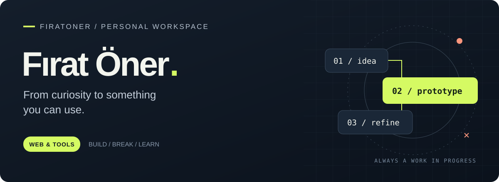

<!-- Alternative profile design. README.md is preserved unchanged. -->
<picture>
  
</picture>

  <a href="https://firatoner.dev"><strong>Portfolio ↗</strong></a>
  &nbsp; / &nbsp;
  <a href="mailto:firatonerdev@gmail.com">Email</a>
  &nbsp; / &nbsp;
  <a href="https://discord.com/users/439683620064722945">Discord</a>
  &nbsp; / &nbsp;
  <a href="https://github.com/firatoner?tab=repositories">Repositories</a>

## Hey, I'm Fırat.

I build web experiences and small tools, following ideas that make me curious. Some become useful products; others stay experiments. This is where I keep both.

**Human curiosity. AI-assisted commits.** I use AI as part of my workflow — to explore, build and review. The direction and decisions are mine.

 

## A few things I've been building

<table>
  <tr>
    <td width="50%" valign="top">
      <h3>01 / RuneBuilds</h3>
      
A League of Legends companion for exploring champions and builds.

      
<code>GAME DATA</code> <code>WEB PRODUCT</code>

      <a href="https://runebuilds.lol"><strong>Explore the site ↗</strong></a>
    </td>
    <td width="50%" valign="top">
      <h3>02 / PortfoyPro</h3>
      
A portfolio tracking project, with separate frontend and backend repositories.

      
<code>NEXT.JS</code> <code>TYPESCRIPT</code>

      <a href="https://github.com/firatoner/PortfoyPro-Frontend"><strong>Frontend ↗</strong></a>
      &nbsp; · &nbsp;
      <a href="https://github.com/firatoner/PortfoyPro-Backend">Backend ↗</a>
    </td>
  </tr>
  <tr>
    <td width="50%" valign="top">
      <h3>03 / Portfolio experiments</h3>
      
A playground for interfaces, motion and how a personal website feels.

      
<code>REACT</code> <code>GSAP</code>

      <a href="https://github.com/firatoner/persona-sparkle-page"><strong>View the repository ↗</strong></a>
    </td>
    <td width="50%" valign="top">
      <h3>04 / One Click Screenshot</h3>
      
A small browser extension with one job: take a screenshot in one click.

      
<code>JAVASCRIPT</code> <code>BROWSER TOOL</code>

      <a href="https://github.com/firatoner/One-Click-Screenshot-Web-Extansion"><strong>View the repository ↗</strong></a>
    </td>
  </tr>
</table>

 

## On my workbench

**TypeScript · JavaScript · React · Next.js · Node.js · Python**

I like a short loop: **ask a question → make a prototype → try it → improve it.**

  
<strong>A little further back</strong>

   

  My repositories also hold the path here: [Python learning notes](https://github.com/firatoner/Python_Zero_to_Hero), [Discord bot lessons](https://github.com/firatoner/discord-bot-dersleri) and plenty of small experiments. I keep them around because the learning is part of the work.

---

  Bir fikirle başlıyor. Yaparak öğreniyorum. 
  <a href="https://firatoner.dev">firatoner.dev</a> &nbsp; / &nbsp; <a href="mailto:firatonerdev@gmail.com">Let's talk</a>

